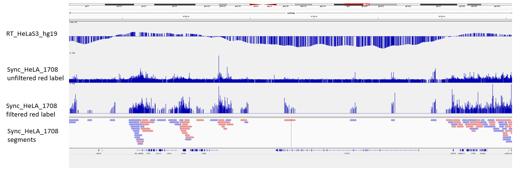

# DNA-rep
Code for DNA replication projects
## References
Das S et al. 2015. [Replication timing is regulated by the number of MCMs loaded at origins.](http://genome.cshlp.org/content/25/12/1886.abstract)

## BioNano
Trial filtering and segmenting protocol for BioNano data

Example: Sync_HeLA_1708

```bash
./direction_bed_seg_new_format.py -b input.bnx -x input.xmap -o output.bed
```
Requirements:

numpy version >= 1.10.2 

Input:
* -b : bnx file WITHOUT HEADER (header lines start with #).  
 Assumes green labeling in Channel 1 and red labeling in Channel 2.  
 *\# Nickase Recognition Site 1:   gctcttc;green_01*  
 *\# Nickase Recognition Site 2:   cacgag*  
 
  If opposite use [direction_bed_multi_segment.py](BioNano/direction_bed_multi_segment.py).  
  Further information on bnx file format here: [30038-Rev-B-BNX-v1.2-File-Format-Specification-Sheet.pdf](https://bionanogenomics.com/wp-content/uploads/2017/03/30038-Rev-B-BNX-v1.2-File-Format-Specification-Sheet.pdf)
* -x : xmap file associated with bnx.  
  Further information on xmap file format here: [30040-Rev-B-XMAP-File-Format-Specification-Sheet.pdf](https://bionanogenomics.com/wp-content/uploads/2017/03/30040-Rev-B-XMAP-File-Format-Specification-Sheet.pdf)  
  Extra documentation on input files here: [bnx and xmap description](https://www.dropbox.com/s/ve11ifaitjfkgja/bubbleDNA_filedescription_ver2.docx?dl=0)
  
Output: 

* -o : (Example: Sync_HeLA_1708_direction.bed) bed like file where each row is a segment of filtered red label data with the following columns:
    * chrom
    * start
    * end
    * molecule ID
    * fork direction ('+' = rightward moving fork, '-' = leftward moving fork)
    * direction strength
    * sum of red label signal in segment
    
    Filtering:  
    Data from molecules with a red label with at least 5 neighboring red labels within 20kb. Keep these 5 neighbor red labels and their associated neighbors. 
    
    Segmenting:  
    Molecules segmented if distance to next label is > 30kb

* .bedGraphs for unfiltered red label tracks
* .bedGraphs for filtered red label tracks

Viewing output tracks on IGV:



To generate bam file for "Sync_HeLA_1708 segments" track above:
```bash
./cleanbed_for_bed.py Sync_HeLA_1708_direction.bed > Sync_HeLA_1708_direction_clean.bed
sort -k1,1V -k2,2n Sync_HeLA_1708_direction_clean.bed > Sync_HeLA_1708_direction_clean_sorted.bed

bedtools bedtobam -i Sync_HeLA_1708_direction_clean_sorted.bed -g hg19.genome > Sync_HeLA_1708_direction.bam
samtools sort Sync_HeLA_1708_direction.bam Sync_HeLA_1708_direction_sort
samtools index Sync_HeLA_1708_direction_sort.bam
```


